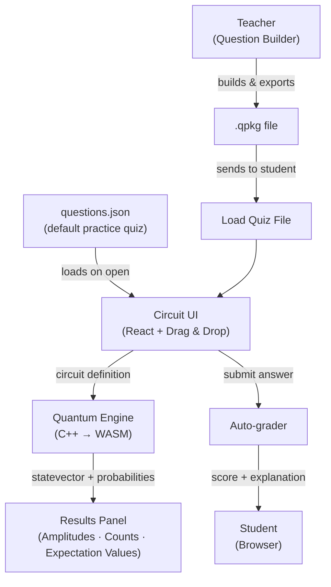

# Quantum Circuit Visualizer

**Website:** https://iqc-circuit-visualizer.vercel.app 

A browser-based drag-and-drop quantum circuit visualizer & simulator! 

No installation required! The visualizer supports **drag-and-drop circuit building** with timesteps, full statevector inspection, shot-based measurement histograms, single-qubit state tomography, and complex circuit features including multi-qubit gates, barriers, and classical feed-forward. 

It also doubles as an educational tool. 
- A **built-in set of guided questions** covers gates, superposition, entanglement, measurement, and feed-forward, and serves as an interactive walkthrough for learning quantum computing from the ground up. 
- For teachers, a **full question builder** allows creating custom circuit questions with blanks, hidden blocks, and auto-grading, which can be exported and sent to students as a single file.

## Features

- **Drag-and-drop circuit builder** with support for single-qubit gates (H, X, Y, Z, S, T), two-qubit gates (CNOT, CZ), three-qubit gates (Toffoli), measurement, and classical feed-forward (FF_X, FF_Z)
- **Timestep visualization** with barriers to structure circuit stages
- **Statevector panel** showing complex amplitudes for all basis states
- **Measurement histogram** with configurable shot count to observe sampling statistics
- **Single-qubit state tomography** by clicking any qubit label (e.g. `q[0]`) to display ⟨X⟩, ⟨Y⟩, ⟨Z⟩ Pauli expectation values in the results panel
- **Built-in guided questions** that double as a step-by-step learning guide, no file needed
- **Quiz mode** for loading teacher-created `.qpkg` question sets with blanks, hidden circuit regions, and per-question explanations
- **Question Builder** for teachers to create, export, and share custom quizzes

## User Guide

### Getting Started

Open the app in a browser. The free-form **Circuit Builder** is on the home page: drag gates from the left palette onto the grid and inspect the results. You can change number of shots, refresh the runs, and find the probabilities and amplitudes associated with your quantum state. Copy the generated circuit code to recreate your circuit at any time!

The **Learn with Circuits** tab loads a set of built-in questions that progressively introduce quantum concepts. These work as both a tutorial and a practice set.

Teachers can use the **Question Builder** to create custom quizes with significant customization options to design questions, and send it to students.


### Reading the Results

After running a circuit, the results panel on the left shows:

| Panel | What it shows |
|---|---|
| **Amplitudes** | The complex amplitudes of each basis state in the statevector |
| **Counts** | A histogram of measurement outcomes sampled over multiple shots |
| **Expectation Values** | Click any qubit label (e.g. `q[0]`) to see ⟨X⟩, ⟨Y⟩, ⟨Z⟩ for that qubit |

**Expectation values per qubit:** Click a qubit label on the left side of the circuit (e.g. `q[0]`, `q[1]`) to show the Pauli expectation values ⟨X⟩, ⟨Y⟩, ⟨Z⟩ for that qubit in the results panel. This is useful for reading out the qubit state in different measurement bases, and effectively gives a single-qubit state tomography readout.

**Amplitudes and counts**: amplitudes show the exact statevector entries, and counts show a sampled histogram (default 100 shots) to illustrate measurement statistics.

**Timestep-by-timestep state:** Use barriers to visually separate circuit stages. The simulation runs the full circuit as built; to inspect the intermediate state at a given point, place a measurement gate at that timestep. The statevector and probabilities always reflect the full circuit as built.


### For Teachers: Creating & Sending a Quiz

1. Go to the **Question Builder** (the "Builder" tab in the navigation).
2. Build each question:
   - Set the number of qubits and timesteps.
   - Drag gates onto the circuit to define the starting circuit (what students see).
   - Mark certain cells as **blanks** for students to fill in.
   - Optionally add **hidden blocks** to obscure part of the circuit.
   - Set the allowed gate palette (restrict which gates students can use).
   - Add a title, description (supports LaTeX math), and an explanation shown after submission.
   - Define the correct answer circuit.
3. Click **Export Quiz** and give the quiz a title. This downloads a `.qpkg` file.
4. Send the `.qpkg` file to your students (email, LMS, etc.).

You can also click **Save JSON Backup** at any time to save your work-in-progress as a `.json` file, which you can reload later with **Load JSON Backup**.


### For Students: Loading & Taking a Quiz

1. Open the app in your browser.
2. Click the **Questions** tab.
3. Click **Load Quiz File** and select the `.qpkg` file your teacher sent you.
4. The questions appear in the left panel. Click a question to open it.
5. Drag gates from the palette on the left into the blank slots on the circuit.
6. Click **Run** to simulate the circuit and see results.
7. When satisfied, click **Submit** to check your answer and see your score.
8. After submitting, the explanation for that question is revealed.

If you do not have a `.qpkg` file, the built-in practice questions load automatically with no file needed.

## Custom Hosting on Vercel

You can deploy your own instance in a few minutes. This is an option for teachers who (1) want their quiz to be the default, (2) make changes/ add features, **and/or** (3) if they want to host the code themselves.

### Steps

1. **Fork or clone this repository.**
2. **Import the project into Vercel:**
   - Go to [vercel.com](https://vercel.com) and create a new project from your fork.
   - Set the **Root Directory** to `quantum_ui`.
   - Vercel will auto-detect Vite. The default build settings work without changes.
   - The `vercel.json` file inside `quantum_ui/` handles SPA routing automatically.
3. **Deploy.** Vercel builds and publishes the app. Any subsequent `git push` to `main` triggers a new deployment.

### Setting a Custom Default Quiz

The default practice questions are stored in:

```
quantum_ui/src/questions/questions.json
```

To replace the built-in questions with your own:

1. In the Question Builder, build your questions and click **Save JSON Backup**. This downloads a `questions_backup.json` file.
2. Open `quantum_ui/src/questions/questions.json` in a text editor.
3. Replace the entire file contents with the contents of your `questions_backup.json`.
4. Commit and push. Vercel will redeploy with your questions as the new default.

Students who visit the app will now see your questions in Practice Mode without needing to load any file.

---

## Technical Overview

### Workflow



### Tech Stack

| Layer | Technology |
|---|---|
| UI framework | React 19 |
| Build tool | Vite 8 |
| Styling | Tailwind CSS 4 |
| Routing | React Router 7 |
| Drag & drop | Atlaskit Pragmatic Drag-and-Drop |
| Charts | Recharts |
| Math rendering | KaTeX + remark-math + rehype-katex |
| Animations | Framer Motion |
| Quantum backend | C++ statevector simulator → WebAssembly (Emscripten) |

### Quantum Engine

The backend is a statevector simulator written in C++ (`quantum_engine/src/`) and compiled to a ~40 KB WASM module via Emscripten. The compiled output is committed to `quantum_ui/src/wasm/` and loaded in the browser at runtime. No server-side compute required.

Supported gates: `H`, `X`, `Y`, `Z`, `S`, `T`, `CNOT`, `CZ`, `Toffoli (CCX)`, `MEASURE`, `FF_X` (feed-forward X), `FF_Z` (feed-forward Z).

The simulator maintains a full 2ⁿ statevector. For shot-based histograms the circuit is re-run per shot with probabilistic measurement collapse and renormalization.

To rebuild the WASM module (requires Emscripten):

```bash
cd quantum_engine
./build_wasm.sh
```

### Repository Structure

```
visualizer/
├── quantum_engine/          # C++ simulator source + WASM build scripts
│   ├── src/
│   │   ├── quantum_state.cpp
│   │   ├── simulator.cpp
│   │   ├── gate_registry.cpp
│   │   └── wasm_bindings.cpp
│   ├── CMakeLists.txt
│   └── build_wasm.sh
└── quantum_ui/              # React frontend
    ├── src/
    │   ├── components/      # CircuitCell, ResultsPanel, GateVisual, …
    │   ├── pages/           # App.jsx · QuestionsPage.jsx · QuestionBuilderPage.jsx
    │   ├── questions/
    │   │   └── questions.json   ← edit this for a custom default quiz
    │   └── wasm/            # compiled quantum_engine.wasm + JS glue
    ├── vercel.json
    └── package.json
```
